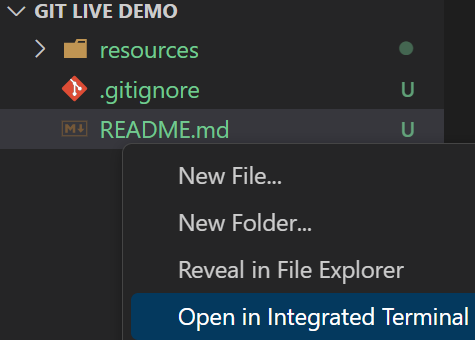
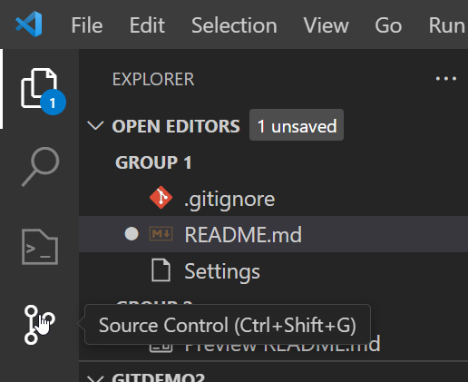
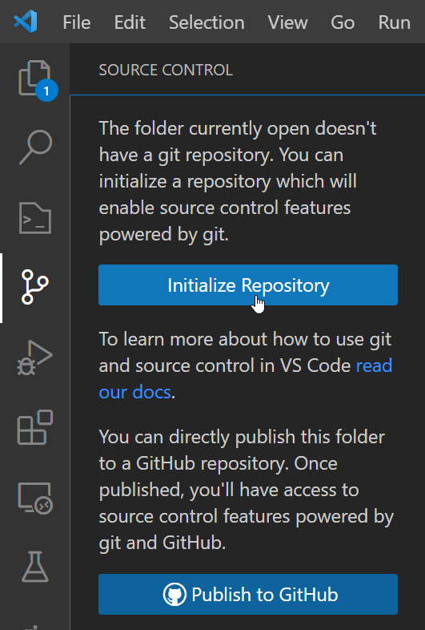
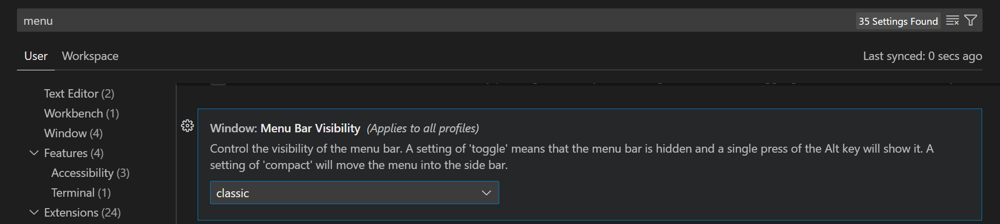

# GitHub Live Demo Workshop
*Setup a Python script to fetch levels from CDA with **emphasis** on using git/github*

**Demo Notes**: ⚠ Disable camera 📷, it will cover the code

## Part 0 - Setup for Both Gui/Terminal
*Initial Setup for VSCode/Git*

1. Install Git (through IT/Online)
2. Install VSCode (IT/Online) and open/launch VSCode
3. Click "File" > "New Window"
4. Click "File" > "Open Folder"
   1. Navigate to where you want your project to live (or where it already lives)
   2. Select the folder you want git to be initialized from
5. (Do ONCE) Setup Git Environment for System
   1. Click "Terminal" > "New Terminal" from the menu bar
   2. In the terminal that opens replace name and email with yours and type these lines, pressing enter after each:
      1. `git config –global user.name "First Last"`
      2. `git config –global user.email "first.m.last@domain.com"`
6. Create a `README.md` and `.gitignore` file:  
    *You can do this at any time!  
    **It is good practice to do it early on.***
   1. Create your `.gitignore`
      1. For Python, Navigate [here](https://github.com/github/gitignore/blob/main/Python.gitignore) and click the 
        Copy Raw File button at the top right of the page.   
       
      2. Paste the contents into your `.gitignore`
   2. Create your `README.md`  
      *In the file you can use [markdown](https://docs.github.com/en/get-started/writing-on-github/getting-started-with-writing-and-formatting-on-github/basic-writing-and-formatting-syntax) to write documentation about whatever directory the `.md` (markdown) file is in.*
      1. Add a title with: `## My Title`
      2. Then add a few bullets with:
         ``` 
             * Bullet 1
             * Bullet 2
         ```
        When you save the file, it will render on github. 


## Part 1 - Using Git with Terminal
*A complete walk through on using git in the terminal for this project (and others)*
1. Open command prompt/terminal
2. Navigate to your project directory
   * **⚠ Shortcut / QOL!**  
     1. Right click in the blank space under your project folder name
     2. Select "Open in Integrated Terminal"  
     This will keep the terminal inside VSCode and save you on `alt+tabbing`
   
3. If you did not chose the integrated terminal you can type:  
        `cd C:\path\to\your\project\`   
        *Be sure the final directory is the root of your project!*
4. ⌨ Initialize the repository
   1. type  `git init` in your terminal
   2. Press enter!
   3. You should now see your `README.md` and `.gitignore` files from earlier
5. Make your first commit:  
   1. Type `git add .` to add all files in your current directory to staging 
      1. ⚠ NOTE:  
       * `git add .` will add **EVERY** file and directory in your current directory.  
       *  Whereas, `git add *` will add every file and directory that does not begin with a dot, i.e. `.gitignore` 
   2. Type `git commit -m "initial project setup"` to commit the staged files
    *The message can be anything descriptive that you want.*
   3. You can now type `git log` to see your first commit
6. Write code/make your changes  
   1. Commit often! Especially when starting new things.
   2. Create a branch if you are working in groups or when it is useful (**see lecture**)
7. Branches
   1. type `git branch dev`  
   *where `dev` is your branch name of choice*
   2. switch to the new branch with `git checkout dev`
   3. Add your new code, make your changes
   4. Commit to the branch as normal (step 5)
   5. You can switch branches, i.e. back to main, but be sure to commit this branch first (or you lose the changes)
8. Merging  
    *You do not **have** to merge*! Only when you need code from one branch in another. 
   1. Switch to the branch to merge changes into
      1. type `git checkout main`
      2. merge the changes with `git merge dev`
      3. Both branches **should be up to date!**
         1. Type `git log` to confirm this 
         2. you will now see  
          `commit <some-long-commit-id> (HEAD -> main, dev)` Showing the HEAD of your git is both `main` and the `dev` branch now
9. Remote Repository  
*Up until now we have been working in our local .git repository*
    1. Create/Login to, a GitHub account
    2. Authenticate your GH account: 
        * If you have not done so already, follow [this guide](/Authenticate/README.md)
    3. Setup/create the remote   
       **Create the remote repo via the website [detailed instructions](https://docs.github.com/en/github-ae@latest/get-started/quickstart/create-a-repo)** (preferred)   
          
        -- **OR**   --  

        *Generate a new remote via terminal*  
         `curl -u 'yourusername' https://api.github.com/user/repos -d '{"name":"projectname","description":"This project is a test"}'` (requires password via GH API)
    4. Copy the git URL to your project  
      
    4. Push our main branch to remote
       1. Set the origin with `git remote add origin https://github.com/krowvin/git-live-demo.git` ◀ copied git url
    5. Switch to the branch we want to push,   
        i.e. main `git checkout main`  
          you will see "Already on 'main'" if you are good to go!
    6. Push our changes with  
       `git push -u origin main`  
        *This sets the upstream branch to main*
    7. Reload your remote repository on github to see your changes!
## Part 2 - Using Git with the VSCode GUI
*A complete walk through on using git in the VSCode GUI for this project (and others)*
1. Initialize your Local Repository
   1. Click the "Source Control" button:
   
   2. Click **"Initialize Repository"**
    
2. If you have any changes you will see them now with a blue "commit" button, otherwise you will see a "publish" button

## Part 3 - Collaborating with Others

## Problems
1. ### Where is my menu bar?  
   *There are a few different styles for the menu bar in VSCode.*
   * Sometimes it is the burger menu (3 horizontal lines)
   * In others it is horizontal text across the top of your VSCode window  
**To Change it:**
     1. Click the ⚙ Gear icon at the bottom left 2. Select "Settings"
     3. Type "menu" in the search
     4. Scroll down until you see "Menu Bar Visibility" 
     5. Select whichever option suits you (i.e. `classic`) 
          


Show how to see if git is installed (terminal)
Setup Git Environment
Initialize Repo
- Create .gitignore
	https://github.com/github/gitignore/blob/main/Python.gitignore
- Create README.md
Add our code, make changes
Commit
Make some more changes
Commit

- Show local .git - i.e. local vs remote
- Show git graph and our changes

Create a branch named "add
